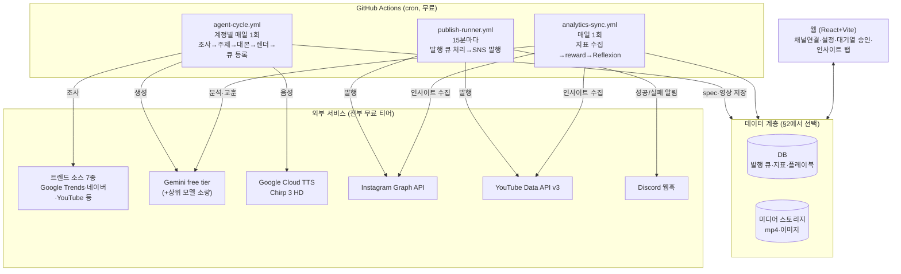

# 01. 아키텍처·인프라

> 담당 역할: **역할 A (파이프라인·인프라)** · 관련 요구사항: 1, 7 · 상위 문서: [기획서 총괄](../기획서.md)

## 1. 시스템 아키텍처

**설계 원칙**: DB 벤더 비종속(§2), 실행은 전부 GitHub Actions(웹이 꺼져 있어도 동작 — 요구사항 7), 웹은 관리 기능만.



각 워크플로는 데이터 접근 계층(`pipeline/lib/repo/`)만 통해 데이터를 읽고 쓴다. repository 인터페이스 하나만 유지하면 DB를 바꿔도 파이프라인 코드는 불변이다.

## 2. DB 후보 비교 (팀 결정 필요 — 착수 1일차에 확정)

| 후보 | 무료 한도 | 발행 큐 구현 | Auth/Storage | 이식 호환 | 비고 |
|---|---|---|---|---|---|
| **Supabase** (관리형 Postgres) | 500MB DB + 1GB Storage + Auth 무제한 | feedr-clone의 `SKIP LOCKED` 큐 SQL **그대로 재사용** | **동봉** (Auth·Storage·Edge Functions·pg_cron) | 최상 | 웹 백엔드까지 한 번에 해결 |
| **Neon** (관리형 Postgres) | 0.5GB, 콜드스타트 있음 | SKIP LOCKED 재사용 가능 | 별도 필요 (Auth 직접 + R2 등) | 상 (SQL 재사용) | 순수 DB만 원할 때 |
| **PlanetScale / MySQL** | 무료 티어 폐지 이력 — 사실상 제외 | 대체 구현 필요 | 별도 필요 | 중 | |
| **MongoDB Atlas** | 512MB | 대체 구현 필요 (findAndModify 잠금) | 별도 필요 | 하 — SQL 자산 포기 | 스키마리스가 장점이 아닌 워크로드 |
| **SQLite (Turso)** | Turso 무료 9GB | 단일 러너 직렬 실행으로 잠금 회피 | 별도 필요 | 중 | 가장 가볍지만 웹 동시접속 제약 |

**권장안: Supabase.** ① Auth·Storage·크론 동봉으로 2~3주 일정에서 세팅 비용 최소 ② 검증된 이식 모듈을 그대로 사용 ③ 무료 한도가 이 규모(계정 4개, 일 4건)에 충분.
**확정은 팀 협의.** 다른 DB를 선택해도 아키텍처는 불변이며 두 가지만 대체하면 된다: (a) 발행 큐 중복 방지 — GitHub Actions `concurrency`로 publish-runner를 단일 실행 직렬화하면 DB 잠금 불필요 (b) 웹 인증·미디어 스토리지 — Cloudflare R2(10GB 무료) 등.

## 3. 스케줄 설계 (요구사항 7 — 웹 독립 실행)

| 워크플로 | cron | 하는 일 |
|---|---|---|
| `agent-cycle.yml` | 계정별 매일 1회, 시각 분산 (예: 06:00/06:30/07:00/07:30 KST) | 에이전트 사이클: 조사→주제→대본→media_spec→TTS→렌더→업로드→발행 큐 등록 (auto는 즉시 큐, hybrid는 승인 대기) |
| `publish-runner.yml` | 15분마다 + `concurrency: publish` 중복 방지 | 발행 시각이 된 큐 항목 발행. 실패 시 지수 백오프, Discord 알림 |
| `analytics-sync.yml` | 매일 1회 (23:30 KST) | 지표 수집 → reward → Reflexion → 주간 리포트 요일엔 인사이트 분석글 |

- GHA cron은 수 분 지연 가능 — 일 1건 발행에는 충분한 정밀도. 정밀도 필요 시 Supabase pg_cron 1분 주기로 승격 가능(선택)
- 모든 워크플로에 `workflow_dispatch` 수동 트리거 — 웹 "지금 실행" 버튼은 GitHub API `POST /repos/{repo}/actions/workflows/{id}/dispatches` 호출

## 4. feedr-clone 이식 모듈 (요구사항 1·17)

원본: `feedr-clone` 저장소. 코드째 복사 후 이 프로젝트 구조에 맞게 수정한다.

| 모듈 | 원본 경로 | 역할 | 수정 포인트 |
|---|---|---|---|
| 무료 트렌드 리서치 7소스 | `supabase/functions/_shared/research.ts` (219줄) | 전부 무료 병렬 수집, 소스 하나 죽어도 계속 | 거의 무수정. 키워드를 개발/IT로 |
| 토큰 암호화 | `_shared/crypto.ts` (40줄) | AES-256-GCM, 토큰 평문 저장 금지 | 무수정 |
| Gemini 클라이언트+에이전트 루프 | `_shared/gemini.ts` (128줄) | 함수호출 루프, 429 재시도(무료 티어 대응) | 무수정 |
| Provider 어댑터 | `_shared/providers/` (types·registry·youtube.ts) | SNS 추가 = 파일 1개 + registry 등록 | youtube.ts 거의 무수정, instagram.ts 신규 |
| 발행 러너 | `functions/publish-runner/index.ts` (136줄) | 클레임→토큰 갱신→발행→실패 분류→백오프→서킷브레이커 | GHA 실행형으로 이식, Discord 알림 추가 |
| 오토파일럿 에이전트 구조 | `functions/autopilot-runner/index.ts` (517줄) | 툴 기반 에이전트, auto/approve 모드, Reflexion | GHA 실행형으로 이식, 영상 툴 추가 |
| 발행 큐 SQL | `migrations/0002_queue.sql` | `claim_due_targets()` SKIP LOCKED, `reset_stuck_targets()` | Postgres 계열 선택 시 재사용 |
| 에이전트 가드 | `_shared/autopilot.ts` (22줄) | "가드는 프롬프트가 아니라 코드로 강제" | 무수정 |
| 웹 보일러플레이트 | `_shared/db.ts`, `src/lib/api.ts`, `src/auth/` | 인증·API 래퍼 | Supabase 선택 시 무수정 |
| SVG 스파크라인 | `src/app/analytics/AnalyticsPage.tsx:22-88` | 의존성 없는 차트 | 무수정 |
| 대기열/캘린더/컴포저 화면 | `src/app/{queue,calendar,composer}/` | hybrid 승인 UI 기반 | 필요 부분만 |

**이식하지 않는 것**: 마케팅 페이지(요구사항 14), Threads provider, recharts(미사용 의존성).

## 5. 저장소 구조(안)

```
multiagent-sns/
  .github/workflows/        agent-cycle.yml · publish-runner.yml · analytics-sync.yml
  pipeline/                 GHA에서 실행되는 파이프라인 코드 (TypeScript/Node)
    agents/                 사이클 오케스트레이션·툴 정의
    research/               트렌드 7소스
    render/                 media_spec → mp4 (remotion/ 또는 ffmpeg/), TTS
    providers/              instagram.ts · youtube.ts · types.ts · registry.ts
    lib/                    crypto.ts · gemini.ts · notify.ts · repo/ (데이터 접근 계층)
  web/                      React+Vite (채널·설정·대기열·인사이트·알림)
  db/                       마이그레이션 (선택한 DB 기준)
  docs/                     기획 문서
```

## 6. API·환경 사전 준비 체크리스트

- [ ] Meta 개발자 앱: `instagram_content_publish`·`instagram_basic`·`instagram_manage_insights`·`pages_show_list` (**1일차 신청 — 최대 일정 리스크**)
- [ ] IG 프로페셔널 계정 2개 + 각각 Facebook 페이지 연결
- [ ] YouTube 채널 2개 (구글 계정 2개)
- [ ] Google Cloud: OAuth 클라이언트(YouTube Data API v3, 가능 시 Analytics API) + Cloud TTS API 활성화(카드 등록 필요, 무료 한도 내)
- [ ] Gemini API 키 (free tier)
- [ ] 네이버 개발자 API 키 (검색·데이터랩)
- [ ] Pexels·Pixabay API 키
- [ ] Discord 서버 + 웹훅 URL
- [ ] DB 인스턴스 (§2 팀 결정 후)
- [ ] GitHub repo secrets: `GEMINI_API_KEY`, `GOOGLE_TTS_KEY`, `TOKEN_ENC_KEY`(base64 32B), `DISCORD_WEBHOOK_URL`, `DB_URL`, OAuth 클라이언트 ID/Secret 일체
