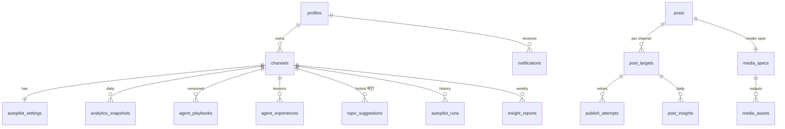

# 02. 데이터 모델

> 담당 역할: **역할 A (파이프라인·인프라)** · 상위 문서: [기획서 총괄](../기획서.md) · 선행: [01-아키텍처·인프라](01-아키텍처-인프라.md) §2 DB 확정
> **1주차에 이 문서(+media_spec 스키마)를 확정하면 렌더/에이전트/웹을 가짜 데이터로 병렬 개발할 수 있다.**

## 1. 논리 ERD (DB 벤더 비종속)

## 2. 테이블 상세

| 테이블 | 핵심 필드 | 비고 |
|---|---|---|
| `profiles` | id, email, role | 팀원 2명 |
| `channels` | id, provider(`instagram`\|`youtube`), provider_account_id, access_token_enc, refresh_token_enc, token_expires_at, status(`active`\|`expired`\|`blocked`) | 토큰은 암호문만. (provider, provider_account_id) 유니크 → 플랫폼당 다계정 |
| `autopilot_settings` | channel_id(UK), mode(`auto`\|`hybrid`\|`off`), persona, guidelines, daily_limit(기본 1), slot_time | **실험 변수 = mode** |
| `posts` | id, title, body, hook_pattern(`bold_claim`\|`curiosity`\|`story`\|`shock`\|`question`), format(`card`\|`reels`\|`shorts`), topic, edited_by_human(bool) | hook_pattern·format이 성과 분석 축 |
| `media_specs` | post_id(UK), spec(JSON — [04-영상제작](04-영상제작.md) §3), spec_version | 같은 spec → 같은 영상(결정론 재현) |
| `media_assets` | id, media_spec_id, kind(`video`\|`image`\|`audio`), storage_path, checksum, duration_s, width, height, quality_status(`passed`\|`failed`), quality_report(JSON) | 규격 검증 결과 포함 |
| `post_targets` | id, post_id, channel_id, status(`draft`\|`pending_approval`\|`queued`\|`publishing`\|`published`\|`failed`\|`canceled`), scheduled_at, published_at, external_id, attempt_count, next_attempt_at, error_message | **발행 큐 본체.** hybrid 초안은 `pending_approval` |
| `publish_attempts` | id, post_target_id, attempt_no, container_id, result, error_class(`auth`\|`quota`\|`spam_block`\|`transient`\|`render`), created_at | IG 컨테이너 재사용·멱등의 근거 |
| `analytics_snapshots` | channel_id, date(UK 복합), followers, total_views, metrics(JSON) | **결측=NULL** (0 금지) |
| `post_insights` | post_target_id, date(UK 복합), views, likes, comments, saves, shares, watch_time_s | 〃 |
| `topic_suggestions` | id, channel_id, topic, rationale, status(`suggested`\|`picked`\|`dismissed`) | hybrid 주제 선택 |
| `autopilot_runs` | id, channel_id, started_at, finished_at, status, report, actions(JSON 배열), cost_estimate | 에이전트 실행 추적 + 비용 원장(S4 지표) |
| `agent_experiences` | id, channel_id, lesson, evidence(JSON), created_at | Reflexion 교훈 |
| `agent_playbooks` | id, channel_id, version(UK 복합), guidance, created_at | 전략 플레이북, 버전 보존 |
| `insight_reports` | id, channel_id, week, body, figures(JSON — 코드 집계값) | 주간 분석글. body의 수치는 figures에서만 인용 |
| `notifications` | id, kind, severity, title, body, channel_id?, created_at, read_at | 알림 로그 (Discord와 이중화) |

## 3. 구현 노트

- **Postgres 계열 선택 시**: `post_targets` 클레임은 feedr-clone `claim_due_targets()`(FOR UPDATE SKIP LOCKED) 재사용 — 동시 실행에도 중복 발행 0. 지표 테이블엔 CHECK 제약으로 결측=NULL을 물리 강제
- **타 DB 선택 시**: publish-runner를 GitHub Actions `concurrency`로 단일 실행 직렬화 → 잠금 없이 안전
- **결측=NULL 원칙**: 신규 게시물의 지표 미노출 구간을 0으로 채우면 평균·기울기가 오염된다. 모든 지표 결측은 NULL로 저장하고 집계에서 제외
- LLM이 기록할 수 있는 착지점은 `posts.body`, `media_specs.spec`, `agent_playbooks.guidance`, `agent_experiences.lesson`, `insight_reports.body` 5곳으로 제한(툴 미노출로 강제) — 수치 필드는 전부 코드만 기록
