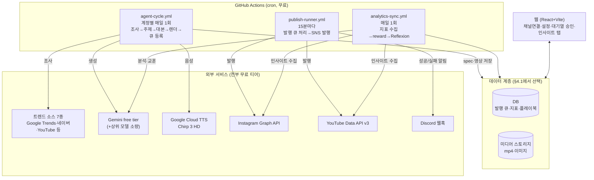
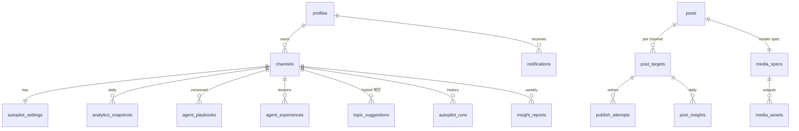

# multiagent-sns 기획서

> 버전: v2.0 (2026-08-11) · 작성 기준: 팀 요구사항 17개 (§16 추적표 참조)
> 본 문서 단독으로 구현 착수가 가능하도록 작성한다. 기존 docs/PLAN.md·SPEC.md·ERD.md와 독립적인 문서다.

---

## 1. 개요·목표·성공지표

### 1.1 한 줄 정의

인스타그램·유튜브 각 2계정(완전자동 vs AI+사람)을 딥에이전트가 자동으로 키우며,
**"계정이 크는 이유/안 크는 이유"를 수치 근거로 발행하는 SNS 자동화 성장 실험 시스템.**

### 1.2 목표 (2~3주, 2인)

1. 트렌드 조사 → 콘텐츠 생성(카드뉴스·릴스·쇼츠) → 자동 발행 → 지표 수집 → 분석 → 전략 개선의 **전체 루프 무인 관통**
2. 완전자동(auto) 계정 vs AI+사람(hybrid) 계정의 성장 비교에서 **유의미한 인사이트 도출**
3. 전 구간 무료 티어로 구성해 **운영 비용 0원대** 유지

### 1.3 성공지표

| # | 지표 | 정의 | 측정 방법 |
|---|---|---|---|
| S1 | 무인 발행 성공률 | 사람 개입 없이 발행까지 완주한 사이클 비율 (auto 계정) | `publish_attempts` 상태 집계 |
| S2 | 계정별 성장 기울기 | 팔로워·조회수·참여율의 일 단위 추이 기울기 | `analytics_snapshots` 회귀 |
| S3 | 모드 간 차이 | auto vs hybrid의 글당 조회/참여율/팔로워 증가 비교 | 인사이트 탭 비교 지표 |
| S4 | 사이클당 비용 | LLM+TTS+렌더+저장 합산 | 호출 로그 기반 코드 집계 |

주의: 2~3주는 통계적 유의성을 확보하기엔 짧다. 인사이트는 **정량 지표 + 정성 관찰(어떤 콘텐츠·훅·발행시간이 반응을 얻었나)**의 혼합으로 정의하고, 수치는 반드시 코드가 집계한 값만 사용한다(LLM이 수치를 지어내지 않게 함).

---

## 2. 실험 설계 — 계정 4개, 변수는 "모드" 하나

| 계정 | 플랫폼 | 모드 | 운영 방식 |
|---|---|---|---|
| IG-A | Instagram | `auto` | 조사→생성→검수→발행 전 과정 무인 |
| IG-B | Instagram | `hybrid` | AI가 주제 제안·초안 생성 → 사람이 승인/수정 후 발행 |
| YT-A | YouTube | `auto` | 〃 (쇼츠) |
| YT-B | YouTube | `hybrid` | 〃 (쇼츠) |

**통제 변수** — 비교가 유효하려면 모드 외에는 조건을 동일하게 유지한다:

- 동일 주제 도메인(§3), 동일 발행 슬롯(시각), 동일 영상/카드 템플릿 풀, 동일 발행 빈도(일 1건)
- 채널별 오토파일럿 설정(`autopilot_settings`)이 계정 단위라서, **모드 값 하나만 다르게** 주면 실험 장치가 완성된다 (feedr-clone의 auto/approve 모드 개념 계승)

**hybrid의 사람 개입 지점** — 웹 대기열 화면에서: ① 제안된 주제 3~5개 중 선택 ② 초안 수정(제목/대본/발행시각) ③ 승인 버튼. 개입 내역은 `posts.edited_by_human` 플래그로 기록해 분석 시 "사람이 어디를 고쳤을 때 성과가 달라졌나"를 볼 수 있게 한다.

---

## 3. 콘텐츠 주제

**기본안: 개발/코딩 팁** (팀 협의로 최종 확정, 아래 비교표 참고)

| 후보 | 트렌드 소재 수급 | 영상화 적합성 | 제재 방어(독창성) | 비고 |
|---|---|---|---|---|
| ① 개발/코딩 팁 (기본안) | 상 — GitHub 트렌딩, 릴리스 뉴스, 팁 무한 | 상 — 코드 화면·도표가 자체 그래픽이 됨 | **상** — 코드 화면은 매 영상 고유 | 팀 도메인 지식 활용 가능 |
| ② IT/테크 뉴스 요약 | 상 — 매일 뉴스 발생 | 중 — 이미지 소스 확보 필요 | 중 — 뉴스 재가공은 어그리게이터 판정 위험 | 시의성 강점, 저작권 주의 |
| ③ 심리·상식 | 중 | 중 — 텍스트 중심 | 하 — 양산형 니치라 경쟁·제재 위험 최상 | 대중성 높으나 레드오션 |

**①을 기본안으로 두는 이유**: 유튜브 "비진정성 콘텐츠" 정책·인스타 비독창 콘텐츠 제재(§10.5)를 피하려면 매 영상에 자체 제작 그래픽이 필요한데, 개발 주제는 코드 화면·직접 그린 도표가 그 요건을 구조적으로 충족한다. 한국어 개발/IT 쇼츠 자동화 니치는 조사 결과 비어 있다.

---

## 4. 시스템 아키텍처

**설계 원칙**: DB 벤더 비종속(§4.1), 실행은 전부 GitHub Actions(웹이 꺼져 있어도 동작 — 요구사항 7), 웹은 관리 기능만.



각 워크플로는 DB의 데이터 접근 계층(`src/lib/repo/`)만 통해 데이터를 읽고 쓴다. repository 인터페이스 하나만 유지하면 DB를 바꿔도 파이프라인 코드는 불변이다.

### 4.1 DB 후보 비교 (팀 결정 필요 — 착수 1일차에 확정)

| 후보 | 무료 한도 | 발행 큐 구현 | Auth/Storage | 이식 호환 | 비고 |
|---|---|---|---|---|---|
| **Supabase** (관리형 Postgres) | 500MB DB + 1GB Storage + Auth 무제한 | feedr-clone의 `SKIP LOCKED` 큐 SQL **그대로 재사용** | **동봉** (Auth·Storage·Edge Functions·pg_cron) | 최상 — 이식 모듈이 이 구조 기준 | 웹 백엔드까지 한 번에 해결 |
| **Neon** (관리형 Postgres) | 0.5GB, 콜드스타트 있음 | SKIP LOCKED 재사용 가능 | 별도 필요 (Auth 직접 구현 + R2 등) | 상 (SQL 재사용) | 순수 DB만 원할 때 |
| **PlanetScale / MySQL** | 유료화됨(무료 티어 폐지 이력) — 사실상 제외 | 대체 구현 필요 | 별도 필요 | 중 | |
| **MongoDB Atlas** | 512MB | 대체 구현 필요 (findAndModify 잠금) | 별도 필요 | 하 — SQL 자산 포기 | 스키마리스가 장점이 아닌 워크로드 |
| **SQLite (Turso)** | Turso 무료 9GB | 단일 러너 직렬 실행으로 잠금 회피 | 별도 필요 | 중 | 가장 가볍지만 웹 동시접속 제약 |

**권장안: Supabase.** 근거 — ① Auth·Storage·크론까지 동봉되어 2~3주 일정에서 세팅 비용이 가장 낮다 ② 검증된 이식 모듈(큐 SQL, Edge Function 보일러플레이트)을 그대로 쓴다 ③ 무료 한도가 이 규모(계정 4개, 일 4건 발행)에 충분하다.
**단, 확정은 팀 협의로 한다.** 다른 DB를 선택해도 아키텍처는 불변이며, 아래 두 가지만 대체 구현하면 된다: (a) 발행 큐의 중복 방지 — GitHub Actions `concurrency` 설정으로 publish-runner를 단일 실행으로 직렬화하면 DB 잠금 자체가 불필요해짐 (b) 웹 인증·미디어 스토리지 — Cloudflare R2(10GB 무료) 등.

### 4.2 스케줄 설계 (요구사항 7 — 웹 독립 실행)

| 워크플로 | cron | 하는 일 |
|---|---|---|
| `agent-cycle.yml` | 계정별 매일 1회, 시각 분산 (예: 06:00/06:30/07:00/07:30 KST) | 에이전트 사이클 실행: 트렌드 조사 → 주제 선정 → 대본 → media_spec → TTS → 렌더 → 스토리지 업로드 → 발행 큐 등록 (auto는 즉시 큐, hybrid는 승인 대기 상태로) |
| `publish-runner.yml` | 15분마다 (`*/15 * * * *`) + `concurrency: publish` 로 중복 실행 방지 | 발행 시각이 된 큐 항목을 발행. 실패 시 지수 백오프 재시도, Discord 알림 |
| `analytics-sync.yml` | 매일 1회 (23:30 KST) | 계정·게시물 지표 수집 → reward 산출 → Reflexion(교훈·플레이북 갱신) → 주간 리포트 요일엔 인사이트 분석글 생성 |

- GitHub Actions cron은 지연이 있을 수 있으나(수 분), 일 1건 발행에는 충분한 정밀도다.
- 수동 트리거(`workflow_dispatch`)를 모든 워크플로에 열어 웹/CLI에서 즉시 실행 가능하게 한다. 웹의 "지금 실행" 버튼은 GitHub API `POST /repos/{repo}/actions/workflows/{id}/dispatches`를 호출한다.
- Supabase 선택 시 publish-runner는 pg_cron 1분 주기로 승격 가능(발행 시각 정밀도 향상) — 선택 사항.

---

## 5. feedr-clone 이식 모듈 (요구사항 1·17)

원본: `C:\Users\iseul\OneDrive\문서\GitHub\feedr-clone`. 코드째 복사 후 이 프로젝트 구조에 맞게 수정한다.

| 모듈 | 원본 경로 | 역할 | 수정 포인트 |
|---|---|---|---|
| 무료 트렌드 리서치 7소스 | `supabase/functions/_shared/research.ts` (219줄) | Google Trends RSS·네이버 검색/데이터랩·YouTube 인기영상·Gemini 그라운딩 등 **전부 무료** 병렬 수집, 소스 하나 죽어도 계속 진행 | 거의 무수정. 키워드를 개발/IT 도메인으로 |
| 토큰 암호화 | `_shared/crypto.ts` (40줄) | AES-256-GCM, SNS 토큰 평문 저장 금지 | 무수정 |
| Gemini 클라이언트+에이전트 루프 | `_shared/gemini.ts` (128줄) | 함수호출 에이전트 루프, 429 시 20초 대기 재시도(무료 티어 대응), JSON Schema 변환 함정 해결됨 | 무수정 |
| Provider 어댑터 | `_shared/providers/` (types·registry·youtube.ts) | `authUrl/exchangeCode/refresh/publish/fetchChannelStats/fetchPostInsights` 인터페이스. **새 SNS 추가 = 파일 1개 + registry 등록** (요구사항 2 "차후 확장" 대응) | youtube.ts 거의 무수정, instagram.ts 신규(§6.1) |
| 발행 러너 | `functions/publish-runner/index.ts` (136줄) | 큐 클레임 → 토큰 자동 갱신 → 발행 → 실패 분류(스팸차단/인증만료/일시) → 지수 백오프 → 서킷브레이커 | GHA 실행형으로 이식, Discord 알림 추가(§6.3) |
| 오토파일럿 에이전트 구조 | `functions/autopilot-runner/index.ts` (517줄) | 툴 9개 에이전트, auto/approve 모드, 자체검수, Reflexion(교훈`agent_experiences`·플레이북`agent_playbooks`), 실행기록 | GHA 실행형으로 이식, 영상 파이프라인 툴 추가(§8) |
| 발행 큐 SQL | `migrations/0002_queue.sql` | `claim_due_targets()` SKIP LOCKED 원자적 클레임, `reset_stuck_targets()` 크래시 복구 | Postgres 계열 선택 시 재사용. 타 DB면 GHA concurrency 직렬화로 대체 |
| 에이전트 가드 | `_shared/autopilot.ts` (22줄) | "가드는 프롬프트가 아니라 코드로 강제" — 발행 한도 등 순수 함수 검증 | 무수정 |
| 웹 보일러플레이트 | `_shared/db.ts`, `src/lib/api.ts`, `src/auth/` | 인증·API 호출 래퍼 | Supabase 선택 시 무수정 |
| SVG 스파크라인 | `src/app/analytics/AnalyticsPage.tsx:22-88` | 의존성 없는 차트(호버 툴팁 포함) — 인사이트 탭에 사용 (요구사항 13) | 무수정 |
| 대기열/캘린더/컴포저 화면 | `src/app/{queue,calendar,composer}/` | hybrid 모드 승인 UI의 기반 | 필요 부분만 |

**이식하지 않는 것**: 마케팅 페이지(Landing/Pricing 목업 — 요구사항 14 "배포일 잡히면 그때"), Threads provider(대상 아님), recharts(미사용 의존성).

---

## 6. 신규 개발 항목 상세

### 6.1 Instagram provider (`providers/instagram.ts`)

feedr-clone의 `threads.ts`(같은 Meta 계열, 장기토큰 교환·2단계 발행 패턴 동일)를 본떠 작성한다.

- **사전 요건**: IG 프로페셔널(비즈니스/크리에이터) 계정 + 연결된 Facebook 페이지, Meta 개발자 앱에 `instagram_content_publish`, `instagram_basic`, `instagram_manage_insights`, `pages_show_list` 권한
- **발행 (2단계, 멱등 처리 필수)**:
  1. 컨테이너 생성 — `POST /{ig-user-id}/media` · 피드 이미지: `image_url` / 릴스: `media_type=REELS, video_url, share_to_feed=true`. 미디어 URL은 스토리지의 공개(서명) URL
  2. 상태 폴링 — `GET /{container-id}?fields=status_code` 가 `FINISHED`가 될 때까지 (영상은 수십 초 소요)
  3. 게시 — `POST /{ig-user-id}/media_publish?creation_id={container-id}`
  - 컨테이너 ID를 `publish_attempts.container_id`에 저장해 크래시 후 재시작 시 **컨테이너 재사용**(이중 발행 방지)
- **인사이트 수집**: `GET /{media-id}/insights?metric=views,reach,likes,comments,saved,shares`(게시물), `GET /{ig-user-id}/insights?metric=follower_count,reach&period=day`(계정)
- **한도**: 콘텐츠 발행 API 24시간당 25건(계정당) — 일 1건 운영이므로 여유 크나 코드 상수로 상한 강제
- **오류 분류**: 190류(토큰 만료) → 채널 `expired` + 재연동 알림 / "API access blocked"(스팸 차단) → 서킷브레이커: 재시도 없이 해당 채널 오토파일럿 자동 OFF + 알림 / 그 외 → 지수 백오프

### 6.2 영상 렌더 파이프라인 (요구사항 8·9) — 상세는 §10

`media_spec JSON → mp4` 인터페이스로 추상화. GitHub Actions 안에서 실행:

```
media_spec(JSON, 에이전트가 생성)
  → TTS 합성 (Google Cloud TTS Chirp 3 HD, 단어별 타임스탬프 포함)
  → 렌더 (Remotion 1순위 / ffmpeg+ASS 폴백 — §10.2 비교, 1주차 스파이크로 확정)
  → 규격 검증 (9:16, 길이, 안전영역, 오디오 존재 — 코드 가드)
  → 스토리지 업로드 → media_assets 기록 → 발행 큐 등록
```

### 6.3 Discord 알림 (요구사항 11)

- **발신 지점 2곳**: publish-runner의 성공/실패 처리부, agent-cycle·analytics-sync의 최상위 catch
- **구현**: Discord 웹훅 URL(secret)로 `POST { embeds: [...] }` — 함수 하나(`notify.ts`, ~30줄)면 충분
- **알림 내용**: ① 발행 성공: 계정·플랫폼·글 제목·링크 ② 발행 실패: **오류 분류**(토큰 만료/쿼터 초과/스팸 차단/일시 오류/렌더 실패) + 원문 에러 + **LLM 원인 분석 1줄**(Gemini에 에러 컨텍스트를 주고 "원인과 조치를 한 문장으로" — 실패 시 분류명만이라도 발송) ③ 토큰 만료 임박, 서킷브레이커 발동
- 모든 알림은 `notifications` 테이블에도 적재(웹 알림 로그 화면과 이중화)

### 6.4 인사이트 탭 (요구사항 12·13)

웹 화면 상세는 §11.4. 데이터 생성 로직:

- **수치(코드가 계산)**: 계정별 팔로워/조회/참여율 시계열, 성장 기울기(최소자승 회귀), auto vs hybrid 4지표 비교(글당 조회·좋아요·참여율·팔로워 증가 — feedr-clone 비교 박스 계승), 발행 성공률, 훅 패턴별·발행 시간대별 성과
- **분석글(LLM이 서술)**: 주 1회 `insight_reports` 생성 — "이 계정이 크는/안 크는 이유"를 DB 수치를 근거로 서술. **규칙: 인용하는 수치는 반드시 코드가 넘겨준 집계값이어야 하며, 근거 없는 인과 주장은 "근거 부족"으로 표기**(프롬프트 + 출력 검증)

### 6.5 IG 인사이트 수집 (analytics-sync 확장, 요구사항 4)

- YouTube: `channels?part=statistics`(구독자·조회수), 가능 시 YouTube Analytics API(시청 지속시간 — OAuth scope 추가 필요, 2주차 여유 시)
- Instagram: §6.1의 인사이트 엔드포인트
- 계정 단위는 `analytics_snapshots`(일 1행), 게시물 단위는 `post_insights`(게시물×일)에 적재. **결측은 0이 아니라 NULL**로 저장(신규 게시물 지표 미노출 구간을 0으로 오염시키지 않음)

---

## 7. 데이터 모델 (논리 ERD — DB 벤더 비종속)



| 테이블 | 핵심 필드 | 비고 |
|---|---|---|
| `profiles` | id, email, role | 팀원 2명 |
| `channels` | id, provider(`instagram`\|`youtube`), provider_account_id, access_token_enc, refresh_token_enc, token_expires_at, status(`active`\|`expired`\|`blocked`) | 토큰은 암호문만. (provider, provider_account_id) 유니크 → 플랫폼당 다계정 |
| `autopilot_settings` | channel_id(UK), mode(`auto`\|`hybrid`\|`off`), persona, guidelines, daily_limit(기본 1), slot_time | **실험 변수 = mode** |
| `posts` | id, title, body, hook_pattern(`bold_claim`\|`curiosity`\|`story`\|`shock`\|`question`), format(`card`\|`reels`\|`shorts`), topic, edited_by_human(bool) | hook_pattern·format이 성과 분석 축 |
| `media_specs` | post_id(UK), spec(JSON §10.3), spec_version | 같은 spec → 같은 영상(결정론 재현) |
| `media_assets` | id, media_spec_id, kind(`video`\|`image`\|`audio`), storage_path, checksum, duration_s, width, height, quality_status(`passed`\|`failed`), quality_report(JSON) | 규격 검증 결과 포함 |
| `post_targets` | id, post_id, channel_id, status(`draft`\|`pending_approval`\|`queued`\|`publishing`\|`published`\|`failed`\|`canceled`), scheduled_at, published_at, external_id, attempt_count, next_attempt_at, error_message | **발행 큐 본체.** hybrid 초안은 `pending_approval` |
| `publish_attempts` | id, post_target_id, attempt_no, container_id, result, error_class(`auth`\|`quota`\|`spam_block`\|`transient`\|`render`), created_at | IG 컨테이너 재사용·멱등의 근거 |
| `analytics_snapshots` | channel_id, date(UK 복합), followers, total_views, metrics(JSON) | **결측=NULL** |
| `post_insights` | post_target_id, date(UK 복합), views, likes, comments, saves, shares, watch_time_s | 〃 |
| `topic_suggestions` | id, channel_id, topic, rationale, status(`suggested`\|`picked`\|`dismissed`) | hybrid 주제 선택 |
| `autopilot_runs` | id, channel_id, started_at, finished_at, status, report, actions(JSON 배열), cost_estimate | 에이전트 실행 추적 + 비용 집계 원장 |
| `agent_experiences` | id, channel_id, lesson, evidence(JSON), created_at | Reflexion 교훈 |
| `agent_playbooks` | id, channel_id, version(UK 복합), guidance, created_at | 전략 플레이북 버전 보존 |
| `insight_reports` | id, channel_id, week, body, figures(JSON — 코드 집계값) | 주간 분석글. body의 수치는 figures에서만 인용 |
| `notifications` | id, kind, severity, title, body, channel_id?, created_at, read_at | 알림 로그 |

구현 노트: Postgres 선택 시 `post_targets` 클레임은 feedr-clone `claim_due_targets()`(SKIP LOCKED) 재사용, `analytics` 계열엔 `CHECK (NOT (missing AND value IS NOT NULL))`류 제약으로 결측=NULL을 물리 강제. 타 DB 선택 시 publish-runner를 GHA `concurrency`로 직렬화해 잠금 없이 안전하게 만든다.

---

## 8. 딥에이전트 설계 (요구사항 15·16)

feedr-clone autopilot-runner의 검증된 구조(툴 기반 에이전트 + Reflexion)를 계승하고, awesome-Self-Improving-Agents의 기법을 다음처럼 녹인다:

| 기법 | 적용 |
|---|---|
| Self-Refine (자체 검수 루프) | 초안 → 검수 프롬프트(지침 위반·사실오류·중복·훅 강도) → 수정 1회 → 코드 가드 통과 시 확정 |
| Reflexion (실패의 언어화) | 발행 N건+지표 누적 후, 성과와 행동을 대조해 `record_lesson`으로 교훈 기록 → 다음 실행 프롬프트에 주입 |
| 자동 프롬프트 개선 (OPRO류) | 성과 상위 콘텐츠의 특징(훅 패턴·주제·길이·발행시간)을 코드가 추출해 `update_playbook`으로 플레이북 버전업 → 시스템 프롬프트에 주입 |
| 메모리 계층 | 단기=당일 실행 기록(`autopilot_runs`), 장기=교훈(`agent_experiences`)+플레이북(`agent_playbooks`, 버전 보존) |

### 8.1 에이전트 사이클 (agent-cycle.yml 1회 실행 = 1계정 1사이클)

```
1 research_trends(키워드)        ← 무료 7소스 다이제스트 (이식 모듈)
2 pick_topic                     ← 플레이북 + 최근 교훈 + 주제별 과거 성과(topic_stats) 참조
                                    hybrid: 3~5개 topic_suggestions 저장 후 종료(사람 선택 대기)
3 write_script                   ← 훅 문장 별도 생성(패턴 5종 중 선택·기록) + 본문 대본
4 build_media_spec               ← 씬 구성·자막·시각 요소를 JSON으로 확정 (§10.3)
5 synthesize_tts → render_video  ← 코드 실행 (LLM 아님)
6 self_review                    ← LLM 검수 + 코드 가드(규격·한도·금지어)
7 enqueue_publish                ← auto: queued / hybrid: pending_approval
8 record_run                     ← 보고서·액션·비용 기록
```

**통제 원칙(계승)**: 수치 계산·한도 검증·발행은 전부 코드가 수행하고, LLM은 주제 선정·대본·검수·분석글에만 관여한다. LLM이 쓸 수 있는 착지점은 `posts.body`, `media_specs.spec`, `agent_playbooks.guidance`, `agent_experiences.lesson`, `insight_reports.body`로 제한한다(툴 미노출로 강제).

### 8.2 LLM 혼합 전략 (요구사항 17)

| 작업 | 모델 | 근거 |
|---|---|---|
| 트렌드 다이제스트 요약, 자막 분절, 해시태그, 알림 원인 분석 | Gemini Flash (무료 1,500회/일) | 대량·저난도 |
| 주제 선정, 대본(훅 포함), 자체 검수 | Gemini Flash → 품질 미달 시 Pro | 무료 우선, 필요 시 승격 |
| 주간 인사이트 분석글, 플레이북 갱신 | 상위 모델 (Gemini Pro 또는 Claude — 주 수 회 소량) | 판단 품질이 실험 가치를 좌우 |

사이클당 LLM 호출 상한(예: 12회)·일일 비용 상한을 **코드 상수**로 강제하고, 초과 시 사이클 중단+알림. 호출마다 추정 비용을 `autopilot_runs.cost_estimate`에 적산해 S4 지표의 원장으로 쓴다.

---

## 9. 발행 스케줄·스팸 방지 (요구사항 7·10)

- **공식 API만 사용** — 비공식 클라이언트·스크래핑 발행 금지 (계정 정지 1순위 원인 차단)
- **빈도 상한**: 계정당 일 1건(코드 상수 `DAILY_PUBLISH_LIMIT=1`). IG 24h/25건·YouTube 쿼터(업로드 1건≈1,600units, 일 10,000units)의 극히 일부만 사용
- **워밍업**: 계정 개설 직후 1주는 발행 격일 1건 + 프로필 완성(사진·소개·링크)을 사람이 직접. 개설 즉시 API 발행 시작은 스팸 신호
- **발행 시각 지터**: 슬롯 시각에 ±0~10분 랜덤 오프셋 (기계적 정시 발행 패턴 회피)
- **서킷브레이커(계승)**: Meta "API access blocked" 감지 시 재시도 없이 해당 채널 오토파일럿 자동 OFF + Discord 경보. 다른 채널에는 영향 없음
- **콘텐츠 측 방어**: §10.5 (템플릿 다양화·자체 그래픽 — 플랫폼의 "비진정성/비독창" 판정 회피)

---

## 10. 영상 제작 파이프라인 (요구사항 8·9) — 딥서치 결과 반영

### 10.1 결정 상태

**Remotion 1순위 권장, ffmpeg+ASS 폴백. 최종 확정은 1주차 스파이크(양쪽 샘플 각 1건 제작 → 팀 판정) 후.** 렌더 계층은 `media_spec JSON → mp4` 인터페이스로 추상화해 어느 쪽을 골라도 나머지 시스템은 불변.

### 10.2 비교표

| | ffmpeg + ASS 자막 | **Remotion (권장)** |
|---|---|---|
| 단어별 하이라이트 자막 (요즘 쇼츠 표준) | 카라오케 태그로 가능하나 바운스·박스 스타일 한계 | 공식 `@remotion/captions` + template-tiktok으로 기성품 수준 |
| 애니메이션 표현력 | ASS 스펙 안 (페이드·슬라이드) | React/CSS 전부 (스프링, 타이핑 코드블록, 차트, Ken Burns) |
| 렌더 속도 (60초 영상, GHA) | 수십 초 | 수 분 (matrix 병렬로 ~6배 가속 사례) |
| 디자인 반복 | 렌더해봐야 보임 | 브라우저 실시간 프리뷰 (Remotion Studio) |
| 유지보수 (2026-08 실측) | 영구적 | 매우 활발 (56K★, 조사 당일 커밋) |
| 라이선스 비용 | 0원 | **0원 — 3인 이하 팀 무료, 상업 이용·자체 렌더 허용 명시** |
| 팀 적합성 | ffmpeg 필터 학습 | 팀이 이미 쓰는 React |

참고: MoneyPrinterTurbo류 완제품 자동 생성기는 스톡영상 짜깁기+기본 자막이라 "자동생성 티"가 강함 → 구조 참고만 하고 채택하지 않음. moviepy/editly/FFCreator는 정체 또는 표현력 부족, Motion Canvas는 headless 렌더 미지원으로 제외.

### 10.3 media_spec 스키마 (렌더 계층 공용 인터페이스)

```jsonc
{
  "version": 1,
  "format": "shorts",            // card | reels | shorts
  "resolution": [1080, 1920],
  "fps": 30,
  "template": "code-tip-v1",     // 템플릿 풀에서 선택 (§10.5 다양화)
  "palette": "dark-emerald",     // 템플릿 변수 (색·레이아웃 흔들기)
  "tts": { "voice": "ko-KR-Chirp3-HD-Aoede", "audio_path": "...", "words": [{ "w": "여러분", "start_ms": 0, "end_ms": 420 }] },
  "bgm": { "path": "assets/bgm/neutral-01.mp3", "volume_db": -22 },
  "scenes": [
    { "kind": "hook",  "text": "대부분의 개발자는 이거 하나 때문에 성장 못 합니다", "duration_ms": 2800 },
    { "kind": "code",  "code": "const x = ...", "lang": "ts", "highlight_lines": [2], "narration_range": [1, 4] },
    { "kind": "chart", "data": {...}, "chart_type": "bar" },
    { "kind": "outro", "text": "팔로우하고 내일 팁도 받아가세요" }
  ]
}
```

같은 spec은 항상 같은 영상을 만든다(결정론) — LLM 재호출 없이 재렌더 가능, 렌더 실패 재시도 안전.

### 10.4 TTS·자막 타이밍

- **Google Cloud TTS Chirp 3 HD**: 한국어 무료 TTS 중 최상급, **월 100만 자 무료**(60초 쇼츠 300~500자 → 일 4건이어도 한도의 6%), 상업 이용 약관상 명시 허용. SSML `<mark>`(v1beta1)로 **단어별 타임스탬프**를 합성과 동시에 획득 → 자막 싱크에 사용 (Whisper 역전사보다 정확하고 무료)
- **edge-tts는 메인 금지**: GHA 데이터센터 IP에서 403 차단이 반복 확인됨(2025~2026) + 약관 그레이존. 로컬 개발 폴백으로만
- 백업: Kokoro-82M(Apache 2.0, CPU 구동) — 완전 오프라인 필요 시

### 10.5 품질 가이드·제재 방어 (딥서치 근거)

**품질 우선순위** (조사 종합 — 투자 대비 효과 순):

1. **첫 1~3초 훅** — 이탈의 50~60%가 여기서 결정. 훅 문장을 대본과 분리된 단계로 생성하고, 패턴 5종(Bold Claim/Curiosity Gap/Micro-Story/Visual Shock/Direct Question)을 `posts.hook_pattern`에 기록해 성과를 패턴별로 A/B 분석. 인트로·로고·인사말 금지, 첫 프레임부터 결론성 문장
2. **TTS 품질** — "기본 TTS 티"는 시청자·알고리즘 모두에게 저품질 신호 → Chirp 3 HD 채택 근거
3. **독창성 구조** — 아래 제재 방어와 동일
4. **단어별 하이라이트 자막** — 무음 시청 대응(쇼츠 시청 상당수가 무음) + 페이싱 장치
5. **시각 페이싱** — 2~4초마다 화면 변화(씬 전환·줌·요소 등장). faceless 영상에서 얼굴을 대체하는 것이 이 리듬
6. **안전 영역** — 텍스트·핵심 요소는 **중앙 900×1400 박스** 안에만(릴스 상단 210px/하단 310px/우측 84px, 쇼츠 상단 120px/하단 300px/우측 96px가 UI에 가림). 한 벌 렌더로 릴스·쇼츠 겸용. 렌더 후 코드 가드로 검증
7. **BGM 라이선스** — 플랫폼 중립 무료 음원(Pixabay Music 등)으로 통일. YouTube Audio Library는 유튜브 밖(인스타) 사용이 트랙별로 애매하므로 크로스포스팅 파이프라인에선 배제

**제재 방어 (수익화·노출의 전제조건)**:

- 유튜브 "비진정성(inauthentic) 콘텐츠" 정책(2025-07~): 템플릿 양산형 채널은 AI 여부와 무관하게 수익화 퇴출. 판정 기준은 "의미 있는 독창적 해설·실질적 수정·교육적 가치"
- 인스타 비독창 콘텐츠 억제: 어그리게이터 판정 시 탐색탭·릴스탭 추천 완전 제외
- **대응 설계**: ① 매 영상 스크립트가 실질적으로 다르게(주제·구조·정보 밀도 — 에이전트 검수 항목에 "직전 N건과 구조 유사도" 포함) ② 자체 제작 그래픽(코드 화면·도표)을 매 영상에 포함 ③ 템플릿 2~3종 + 색·레이아웃 변수(`palette`)로 시각 다양화 ④ 타인 클립·밈 영상 사용 금지(국내 자동화 실패 사례의 실제 원인이 저작권)

---

## 11. 웹 화면 명세 (요구사항 14 — 자동화 기능만)

React+Vite, feedr-clone 화면 구조 계승. 마케팅/랜딩/꾸미기는 배포일 확정 후로 미룸.

| 화면 | 기능 |
|---|---|
| 11.1 채널 연결 | OAuth로 IG/YT 계정 연결, 토큰 상태(만료 임박·차단) 표시, 재연동 |
| 11.2 오토파일럿 설정 | 채널별: 모드(auto/hybrid/off), 페르소나, 콘텐츠 지침(자유텍스트), 일 발행 한도, 슬롯 시각, "지금 실행" 버튼(GHA dispatch) |
| 11.3 대기열 | 섹션 4개: 승인 대기(hybrid — 주제 선택·초안 수정·승인)/예약됨/발행 완료/실패(오류·재시도). 인라인 편집 |
| 11.4 **인사이트 탭** (요구사항 12·13) | ① 계정 카드: 팔로워 스파크라인·일별 조회 막대(이식 SVG 차트) ② auto vs hybrid 비교: 글당 조회·좋아요·참여율·팔로워 증가 4지표 ③ 성장 기울기·발행 성공률 수치 ④ 훅 패턴별·시간대별 성과 표 ⑤ 주간 분석글(insight_reports — "크는/안 크는 이유", 수치 근거 인용) |
| 11.5 알림 로그 | notifications 목록(Discord와 이중화), 심각도 필터 |

---

## 12. 비용 계획 (요구사항 17)

| 항목 | 서비스 | 무료 한도 | 예상 사용량 (계정 4, 일 4건) |
|---|---|---|---|
| LLM | Gemini Flash free tier | 1,500회/일 | 사이클당 ~10회 × 4 = 40회/일 (3%) |
| TTS | Google Cloud TTS Chirp 3 HD | 100만 자/월 | ~6만 자/월 (6%) |
| 렌더·실행 | GitHub Actions | public repo 무제한 (private 2,000분/월) | 일 ~40분 |
| 영상 프레임워크 | Remotion | 3인 이하 팀 무료 | — |
| 트렌드 | Google Trends RSS·네이버 API(25,000/일)·YouTube API(10,000units/일) | 전부 무료 | 극소량 |
| 스톡/BGM | Pexels(월 2만)·Pixabay API·무료 음원 | 무료 | 극소량 |
| DB/스토리지 | §4.1 선택 (Supabase 무료 500MB+1GB 등) | 무료 | 충분 |
| 알림 | Discord 웹훅 | 무료 | — |
| **합계** | | | **월 0원** (상위 모델 소량 사용 시 월 수천 원 이내) |

방어 장치: 사이클당 호출 상한·일일 비용 상한 코드 상수(§8.2), 초과 시 중단+알림.

---

## 13. 일정·역할 분담 (2인 × 3주)

| 주차 | 마일스톤 | 작업 |
|---|---|---|
| **1주차** | 셋업 + 스파이크 + 계정 준비 | ① **1일차: Meta 개발자 앱 생성·권한 신청(리드타임 최장 — 최우선)**, Google Cloud 프로젝트(OAuth+TTS), DB 확정(§4.1)·인스턴스 생성 ② 계정 4개 개설 + 프로필 완성 + 워밍업 시작(사람 손) ③ feedr-clone 모듈 이식, repo 구조 잡기 ④ **영상 스파이크: Remotion vs ffmpeg 샘플 각 1건 → 렌더 방식 확정** ⑤ 템플릿 v1 디자인 |
| **2주차** | 파이프라인 관통 | ① Instagram provider ② 렌더 파이프라인(GHA) ③ agent-cycle 관통: 조사→대본→렌더→발행 첫 성공(계정 4개 전부) ④ Discord 알림 ⑤ analytics-sync(IG+YT 지표 수집) |
| **3주차** | 학습 루프 + 인사이트 | ① Reflexion·플레이북 루프 가동 ② 인사이트 탭 ③ hybrid 승인 UI 마감 ④ 지표 누적 관찰·훅 패턴 A/B ⑤ **최종 산출: 인사이트 리포트 (auto vs hybrid 비교 + 크는/안 크는 이유)** |

| 모듈 | 담당(DRI) |
|---|---|
| 인프라·DB·이식 | (팀 협의로 기입) |
| Instagram provider·발행 러너 | |
| 영상 렌더·템플릿 | |
| 에이전트 사이클·Reflexion | |
| 웹(대기열·인사이트 탭)·알림 | |

2인이므로 모듈당 1명 주담당 + 상호 리뷰. 병렬화 열쇠: **데이터 모델(§7)과 media_spec(§10.3)을 1주차에 확정**하면 렌더/에이전트/웹을 가짜 데이터로 병렬 개발 가능.

---

## 14. API·환경 사전 준비 체크리스트

- [ ] Meta 개발자 앱: `instagram_content_publish`·`instagram_basic`·`instagram_manage_insights`·`pages_show_list` (1일차 신청)
- [ ] IG 프로페셔널 계정 2개 + 각각 Facebook 페이지 연결
- [ ] YouTube 채널 2개 (구글 계정 2개)
- [ ] Google Cloud: OAuth 클라이언트(YouTube Data API v3, 가능 시 YouTube Analytics API) + Cloud TTS API 활성화(카드 등록 필요, 무료 한도 내 사용)
- [ ] Gemini API 키 (free tier)
- [ ] 네이버 개발자 API 키 (검색·데이터랩)
- [ ] Pexels·Pixabay API 키
- [ ] Discord 서버 + 웹훅 URL
- [ ] DB 인스턴스 (§4.1 팀 결정 후)
- [ ] GitHub repo secrets: `GEMINI_API_KEY`, `GOOGLE_TTS_KEY`, `TOKEN_ENC_KEY`(base64 32B), `DISCORD_WEBHOOK_URL`, `DB_URL`, OAuth 클라이언트 ID/Secret 일체

---

## 15. 리스크

| 리스크 | 영향 | 대응 |
|---|---|---|
| **Meta 앱 권한 심사 지연** | IG 발행 자체 불가 — 최대 일정 리스크 | 1일차 신청. 심사 대기 중엔 개발 모드(테스터 계정 = 자기 계정)로 개발·테스트 가능 — 본 실험은 자기 계정만 쓰므로 **개발 모드로도 진행 가능성 높음**(1주차에 확인) |
| YouTube 업로드 쿼터 | 일 10,000units ÷ 1,600 ≈ 6건 상한 | 일 2건(계정 2개×1) 운영이라 여유. 초과 시 스킵+알림 |
| 신규 계정 스팸 판정 | 노출 제한·차단 | 워밍업·지터·서킷브레이커(§9), 공식 API만 |
| 플랫폼 "비진정성/비독창" 판정 | 추천 제외·수익화 거부 | §10.5 대응 설계 (자체 그래픽·구조 다양화) |
| 렌더 품질이 기대 미달 | 성장 실험 자체가 무의미 | 1주차 스파이크에서 샘플을 팀이 직접 판정 후 진행. 템플릿 개선을 3주차까지 상시 루프로 |
| GHA cron 지연 | 발행 시각 부정확(수 분) | 일 1건 운영엔 무해. 정밀도 필요 시 Supabase pg_cron 승격 |
| 2~3주 내 표본 부족 | 통계적 유의성 한계 | 인사이트를 정량+정성 혼합으로 정의(§1.3), 단정 대신 "근거 부족" 표기 원칙 |

---

## 16. 요구사항 추적표

| # | 요구사항 | 반영 섹션 |
|---|---|---|
| 1 | feedr-clone 기능 계승 | §5 (이식 모듈 표) |
| 2 | 인스타+유튜브, 차후 확장 | §6.1, §5 Provider 어댑터(파일 1개 추가로 확장) |
| 3 | 2인·2~3주·유의미한 인사이트 | §13 (일정), §1.3 (인사이트 정의) |
| 4 | 플랫폼 제공 인사이트 수집 | §6.5 (IG insights·YouTube 통계) |
| 5 | 인사이트 분석 → 자동화된 발전 | §8 (Reflexion·플레이북 루프) |
| 6 | SNS당 2계정, 완전자동 vs AI+사람 | §2 (실험 설계) |
| 7 | 웹 꺼져도 자동발행 | §4.2 (GitHub Actions cron) |
| 8 | 릴스·쇼츠 동영상 제작 | §10 |
| 9 | 이미지·애니메이션 자막 중심 | §10.2~10.4 (단어별 하이라이트 자막·TTS) |
| 10 | 스팸계정 차단 방지 | §9 |
| 11 | 발행 성공/실패 원인 분석·알림 | §6.3 (Discord + LLM 원인 분석) |
| 12 | 크는/안 크는 이유 인사이트 탭 | §6.4, §11.4 |
| 13 | 그래프·지표로 수치 표현 | §11.4 (스파크라인·비교 지표) |
| 14 | 웹은 자동화 기능만 | §11 (마케팅 페이지 배제) |
| 15 | 딥에이전트 기술 반영 | §8 (Self-Refine·Reflexion·OPRO·메모리) |
| 16 | 조사→발행→분석→개선 루프에 딥에이전트 | §8.1 (사이클), §4 (아키텍처) |
| 17 | 무료 트렌드 조사·비용 절감 | §5 (무료 7소스), §8.2 (LLM 혼합), §12 (비용표) |

---

## 부록 A. 저장소 구조(안)

```
multiagent-sns/
  .github/workflows/        agent-cycle.yml · publish-runner.yml · analytics-sync.yml
  pipeline/                 GHA에서 실행되는 파이프라인 코드 (TypeScript/Node)
    agents/                 사이클 오케스트레이션·툴 정의 (autopilot-runner 이식)
    research/               트렌드 7소스 (research.ts 이식)
    render/                 media_spec → mp4 (remotion/ 또는 ffmpeg/), TTS
    providers/              instagram.ts · youtube.ts · types.ts · registry.ts (이식+신규)
    lib/                    crypto.ts · gemini.ts · notify.ts · repo/ (데이터 접근 계층)
  web/                      React+Vite (채널·설정·대기열·인사이트·알림)
  db/                       마이그레이션 (선택한 DB 기준)
  docs/                     본 기획서
```

## 부록 B. 참고 자료 (딥서치 출처 발췌)

- Remotion 라이선스·GHA 렌더: remotion.dev/docs/license/faq · remotion.dev/docs/render
- 틱톡 스타일 자막: remotion.dev/docs/captions/create-tiktok-style-captions · github.com/remotion-dev/template-tiktok
- Google Cloud TTS 무료 한도·SSML mark: cloud.google.com/text-to-speech/pricing
- edge-tts GHA 차단 이슈: github.com/rany2/edge-tts/issues/290
- 유튜브 비진정성 콘텐츠 정책(2025-07): support.google.com/youtube (inauthentic content)
- 인스타 비독창 콘텐츠 억제: TechCrunch 2026-04-30 보도
- 안전 영역: postplanify.com/blog/social-media-safe-zones-2026-complete-guide
- 무료 스톡: pexels.com/api · pixabay.com/api/docs
- IG Graph API 발행·인사이트: developers.facebook.com/docs/instagram-platform/content-publishing
- YouTube Data API 쿼터: developers.google.com/youtube/v3/getting-started#quota
